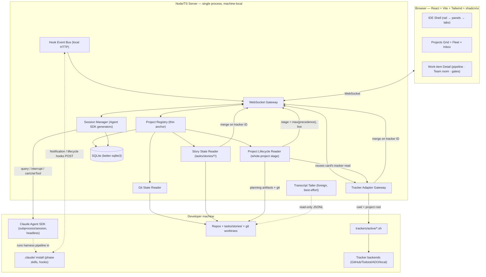
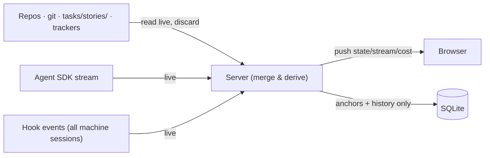

# ARCHITECTURE.md — Development OS (DevOS)

**Version:** 1.0
**Date:** 2026-07-18
**Author:** Anudeep
**Status:** Draft
**Requirements source:** [docs/SPEC.md](SPEC.md) (V1 buildable spec — compiles wayfinder map `6h6M5cm9WjffWxfg`, tickets A–H)

> **Scope of this document:** V1 = local-only, single-user, self-hosted. One instance per developer
> machine, browser UI, reaching into each local project through that project's own installed harness.
> No cloud services, no multi-user, no metered API billing. Deferred items (SPEC §9) are out of scope
> here and noted where they touch a decision.

---

## 1. High-level component diagram

Everything runs in **one Node/TS process per machine**, with the browser as the sole UI. Owned agent
sessions are headless (no terminal) — the UI transcript is the only view into them.



**Component responsibilities:**

| Component | Responsibility |
|---|---|
| **Session Manager** | The core. One long-lived Agent SDK `query()` generator per owned session, multiplexed. Handles spawn / steer / `interrupt()` / permission approval via `canUseTool`. |
| **Hook Event Bus** | Local HTTP endpoint any session on the machine POSTs to (esp. `Notification`). The **only** way to observe foreign sessions the OS didn't spawn; drives the "Needs you" badge. |
| **Project Registry** | Thin-anchor store: persists only `{path, pinned, displayName, uiPrefs}`. |
| **Story State Reader** | Reads `tasks/stories/*/` per project to derive each work item's pipeline phase (which files exist + `executor-state.md` content). |
| **Project Lifecycle Reader** | Derives the *whole-project* stage (New → Decide → Define → Build → Ship) from planning artifacts + git + the card's existing tracker read, via a `max(precedence)` rule, live per render. Powers the home-grid stage badge. See §9. |
| **Tracker Adapter Gateway** | Shells out to each project's own `trackers/active/<op>.sh` (cwd = project root). Zero tracker-specific logic in the OS. |
| **Git State Reader** | Derives branch / dirty / ahead-behind live per render. |
| **Transcript Tailer** | Best-effort, read-only tail of `~/.claude/projects/**/*.jsonl` for foreign sessions. Adapter-isolated, never a steering path. |
| **WebSocket Gateway** | Bidirectional: streams state/cost/stream down; carries steer/interrupt/permission up. |
| **SQLite** | The only persistent store (see §4). |

**Key structural decisions:**
- **Work item vs session.** A *work item* (a harness "story") is durable — it lives as files in
  `tasks/stories/<id>/` and outlives many sessions. A *session* is a disposable, headless engine that
  drives the current phase and dies when context fills. **Many sessions over time serve one work item**;
  the durable story files are the baton handed from a dying session to a fresh one. The UI models and
  displays the *work item*; sessions are plumbing.
- **Context recycling is the harness's job, not the UI's** (resolved decision). The harness phase
  pipeline naturally breaks work into phases/waves, each its own session with files as handoff. The UI
  only *observes* the files and *reattaches* to whichever session is currently live. The UI never
  babysits token/context limits.
- **The work-item list is derived, never stored** — a merge of (Tracker Gateway read) and (Story State
  Reader read), joined on the **tracker ID** (`tasks/stories/42/` ↔ tracker item #42). This makes
  DevOS both tracker-agnostic (all backends via adapters) and tracker-optional (works with none).
- **PTY/tmux terminal-attach is deferred to post-V1** (changed from SPEC's "secondary view"). Owned
  sessions are headless — there is no terminal to attach to; the transcript is the full view. PTY only
  mirrors hand-opened foreign terminals — a side-case, not the main workflow.
- **Two levels of "stage," both live-derived.** *Project-lifecycle* stage (New→Decide→Define→Build→Ship,
  the whole project) sits above the *work-item pipeline* (one task's Analyze→…→PR loop). The Project
  Lifecycle Reader derives the former; the Story State Reader derives the latter. The **Team room is one
  component with two bindings** — project-scoped (drives a planning session) or work-item-scoped (drives
  the build loop). See §9 for the full project-lifecycle level.

---

## 2. Service / platform selection rationale

**Cloud platform:** None — self-hosted / machine-local (SPEC §2, "local-first, no external services").
No Azure/AWS/GCP services. Portable stack throughout. The only unavoidable "lock-in" is to Anthropic's
own Agent SDK, which is correct — the product *is* a Claude control surface.

| Component | Technology | Why this over alternatives | Cloud-specific? |
|---|---|---|---|
| Server runtime | **Node.js + TypeScript** | Agent SDK runs in-process with the richest typed API; one language end-to-end with the React frontend. Runner-up: Python SDK (equally capable, but splits backend/frontend languages). | No |
| Session engine | **Agent SDK (TS) `query()`, streaming input** | Only path giving live steer + `interrupt()` + `canUseTool` in one contract. Runner-up: `claude -p` stream-json — kept as **fallback** only (can't inject into a live turn). | No |
| Frontend | **React + Vite + Tailwind + shadcn/ui** | Matches the reference IDE-shell design; shadcn gives the panel/card/dialog primitives. Vite = fast local dev, no framework server for a local tool. | No |
| Browser↔server transport | **WebSocket** | Genuinely bidirectional (stream down, steer up). Runner-up: SSE — one-way only, can't carry steering. | No |
| State store | **SQLite via `better-sqlite3` (raw, no ORM)** | Local-first, one file, zero external service. Thin-anchor store is ~4 tiny tables — an ORM (Drizzle/Prisma) is overkill. Runner-up: Postgres (needs a running server → violates "no external services"). | No |
| Foreign-session observation | **Hooks → local HTTP** (+ best-effort JSONL tail) | Hooks are the crisp "needs you" signal and fire for sessions the OS didn't spawn. JSONL is internal/fragile → adapter-only, never primary. | No |
| Terminal attach (PTY) | **Deferred to post-V1** | Owned sessions are headless; observation is covered without it. | No |

**Session authentication (VERIFIED):** Programmatic sessions authenticate via the developer's **Claude
subscription (OAuth)**, **not** the pay-per-token API. Verified empirically on the dev Mac with
`ANTHROPIC_API_KEY` empty — both the Agent SDK `query()` and `claude -p` ran successfully, inheriting the
CLI's keychain OAuth login. Implication: no API keys in V1. (Multi-provider model routing, which *would*
require API keys, stays post-V1 per SPEC §9.) **Boundary:** a headless host without the keychain login
would need an API key — not a V1 scenario, since V1 is local-only.

---

## 3. Cost model

DevOS is local and self-hosted — there is no cloud infrastructure to cost out, and sessions run on the
developer's existing Claude subscription. The standard steady-state / burst / unit-economics tables are
therefore **N/A**.

| Cost dimension | Value |
|---|---|
| Infrastructure | **~$0** — runs on the developer's own machine, no cloud, no DB server, no hosting |
| Operating (session usage) | **~$0 metered** — sessions inherit the Claude subscription (OAuth); no per-token API billing (VERIFIED, see §2) |
| The `total_cost_usd` reported by the SDK stream | A **usage/weight indicator** (which work items are heavy), not a real charge under a subscription. Displayed as usage, never as a bill. |

**The real limit is not money — it is the subscription's rate limit.** Concurrency (how many agents can
*actively* work at once) is **rate-limit-bound, not budget-bound**. The fleet UI treats "waiting for
rate limit" as a first-class session state and throttles spawns into a queue (see §5).

---

## 4. Data architecture

**Principle: thin-anchor, live-derive (SPEC §4).** SQLite is the only thing on disk, holding just
anchors + history. Everything real is read live every render and discarded — nothing can go stale.

### Stored (SQLite)

| Table | Holds | Why stored |
|---|---|---|
| `projects(path PK, display_name, pinned, ui_prefs_json, created_at)` | Which folders you track | Anchors |
| `sessions(id PK, project_path FK, work_item_id, sdk_session_id, status, current_stage, created_at)` | Session history + the **work_item_id ↔ session** link (many sessions per work item) | History / continuity |
| `cost_ledger(id PK, session_id FK, input_tokens, output_tokens, cost_usd, at)` | Per-session usage figures | The "cost today" / usage indicator |
| `ui_state(key PK, value_json)` | Layouts, tab state, last-open | Remember the workspace |

### Never stored — derived fresh every read

- Git state (branch / dirty / ahead-behind) — Git State Reader
- Tracker tasks — Tracker Adapter Gateway (per-project adapter scripts)
- Live session state (running / idle / blocked) — SDK stream + Hook Event Bus
- Work-item pipeline phase — Story State Reader (`tasks/stories/*/` files)
- **Transcripts** — not persisted by DevOS (see below)

### Data flow



### Transcript persistence

- **DevOS keeps no transcript copy.** The Team room shows the *live* conversation only; it is discarded
  when the session ends. The durable record of a work item is the harness's `tasks/stories/` files
  (brief / plan / decisions / results), which never expire.
- The underlying Claude Code raw transcripts (`~/.claude/projects/**/*.jsonl`) **auto-delete after 30
  days** (Claude Code's `cleanupPeriodDays`, default 30 — unset in this environment → default applies).
- Reopening an old work item shows its **saved story artifacts**, not a replayed chat. Rationale: the
  *decisions* are what matter long-term, and those live in files; the chatter is not worth keeping.

### Regulated data

**None.** Single-user local dev tool — no PII/PHI. The only sensitive content flowing through is the
developer's own source code and agent transcripts, and it stays entirely on the machine (nothing leaves
except what agents send to Anthropic anyway, independent of DevOS). No classification/encryption-at-rest
tables beyond normal OS file permissions. **Partitioning:** N/A — one user, a handful of projects, a tiny DB.

---

## 5. Scalability model

Single user → "scale" is the number of projects and concurrent agents, not traffic.

| Dimension | Typical | Stress | Bottleneck & mitigation |
|---|---|---|---|
| Pinned projects | 5–15 | 50+ | Live-derive reads (git + tracker) per render. **Fix:** parallelize the fan-out; briefly cache the *derived* view (SPEC §5); light retried health-check on trackers, not a full auth probe per call. |
| Concurrent live agents | 1–5 | 10+ | **Plan rate limits** (not CPU, not money). **Fix:** throttle spawns into a queue; surface "waiting — plan limit" as a first-class fleet state; never silently pile up. |
| Machine resources | fine | many subprocesses | Each owned session = one SDK subprocess. **Fix:** cap concurrent sessions; idle work items hold no process (state is in files). |
| SQLite size | tiny | years of `cost_ledger` | Negligible. **Fix (if ever):** prune old ledger rows. |

**The one real ceiling:** the subscription rate limit caps how many agents can actively work at once.
Spawning is a throttled queue, not unlimited. Everything else scales fine for a single dev well past any
realistic project count.

---

## 6. Security architecture

The app can start agents that **run shell commands and edit files**. That capability *is* the security
surface — the only real risk is another actor reaching it.

### Identity and access

| Layer | Mechanism | Details |
|---|---|---|
| Network exposure | **Bind to `127.0.0.1` only** | Never exposed to the LAN; no remote can reach the server. |
| User auth | **None (by design)** | Single user on localhost — passwords would be theater. |
| Browser → server trust | **Origin check + local token** | Only the app's own page may open the WebSocket — defends against a malicious webpage / DNS-rebinding on localhost. |
| Agent action approval | **`canUseTool` permission cards** | The human approves risky actions. Default is **not** "auto-approve everything" — this is the runaway-agent brake. |

### Data classification

| Classification | Examples | At rest | In transit | Access |
|---|---|---|---|---|
| Internal (only class present) | Source code, agent transcripts, layouts | OS file permissions | Localhost only | Single local user |

No Regulated or Public tiers apply.

### Secret handling

**DevOS stores no secrets.** It never touches the Claude login — it reuses the CLI's keychain OAuth
(§2). No API keys in V1. Nothing to rotate, nothing to leak.

**Compliance Owner sign-off:** Not required — no regulated data, no multi-user, no cloud.

---

## 7. Observability plan

Local tool → lightweight. A good log plus on-screen session states is sufficient; no metrics
dashboards, alerting, or distributed tracing (those are for cloud services with real traffic).

| Concern | Mechanism |
|---|---|
| Server activity | **Structured log file** (session spawned, tracker call failed, hook received) — first stop when something is off. |
| Live session health | On-screen per-agent state: running / idle / blocked / waiting-on-rate-limit. |
| Tracker adapter failure | Surface "tracker unreachable" on the affected project; do not hang the whole view. |
| Hook Event Bus not receiving | Surface "hook bus not connected" — otherwise foreign agents look frozen. |

**Logging policy:** structured (JSON), local file, no special sensitive-data redaction needed beyond
keeping the file under the user's own permissions (it's their own machine and code).

---

## 8. Disaster recovery

Because the app stores almost nothing, recovery is essentially "restart it." No backups, failover, or
recovery drills are warranted for a single-user local tool.

| Metric | Target |
|---|---|
| RTO | Seconds — restart the process |
| RPO | Zero work lost — real work lives in git + `tasks/stories/` files, not in the app |

### Failure scenarios and recovery

| Scenario | Impact | Detection | Recovery | Tested? |
|---|---|---|---|---|
| App crashes mid-session | Live headless agents die with the app | Process exit / UI disconnect | Restart, reopen the item — a fresh session resumes from `tasks/stories/` files (normal context-recycling) | No (V1) |
| SQLite corrupt / deleted | Lose only anchors (pins, layout, cost history) | Open error / empty registry | Re-pin projects; all real state re-derives itself. Optional: copy the small DB file periodically | No (V1) |
| Source code loss | — | — | Protected by **git**, independent of DevOS | N/A |

**Bottom line:** worst case is "restart the app and re-pin projects." Work is never lost because it
lives in git + story files.

---

## 9. Project-lifecycle level (UI ↔ harness)

The level *above* the per-work-item pipeline: how the home Projects Grid represents each whole
project's stage, how a project advances to its next stage, and how a raw idea becomes a tracked
project. Resolved by wayfinder map `6h6gPPWFfHr5PwG8` (tickets T1–T3); folded in here per that map's
destination.

### 9.1 Lifecycle stage model

The canonical stages are the **harness's own five SDLC phases plus a leading "New"**:

```
New → Decide → Define → Build → Ship → (Learn)
```

- Both workflow packs share the five phases; the pack only changes *which skills* live inside a stage.
- The badge shows **one stage word, 5 states in V1** (New / Decide / Define / Build / Ship). **Learn
  folds into Ship** — there is no durable per-project signal to detect it (revisit post-V1).
- The badge is a **sticky high-water mark**: it reflects the highest stage ever reached in the current
  cycle. Live work pushes it forward; idle holds it; it never regresses within a cycle. (How a *new
  milestone* resets the mark is deferred fog — see §9.5.)
- Active/idle is **not** on the badge — that stays on the card's agents strip. The badge is *maturity*,
  not live activity.

### 9.2 Stage detection

**Rule:** `stage = max(precedence)` over the signals below, **recomputed live per render** (never stored
— thin-anchor/live-derive), reusing the per-card local + tracker reads the grid already performs. This
is what the **Project Lifecycle Reader** does.

| Stage | Durable signal (floor / high-water mark) | Source |
|---|---|---|
| **Ship** | ≥1 open PR, a release tag, or merged-PR history | git + code platform |
| **Build** | ≥1 `tasks/stories/<id>/` started (executor-state) or a feature branch with commits | story files + git |
| **Define** | `PRD.md` / `docs/SPEC.md` / `docs/ARCHITECTURE.md` present, or tracker tasks decomposed but unstarted | local files + tracker |
| **Decide** | `grill-summary.md`, a decision-brief, or an open `wayfinder:map` tracker item | local files + tracker |
| **New** | pinned, none of the above | — |
| *(Learn)* | *no reliable durable signal → folds into Ship for V1* | *deferred* |

- **Staleness is not judged.** The highest present signal wins; contradictions self-resolve because we
  take the max. Strictness applies only to "is it the real thing" (a *started* story vs. an empty
  folder). Content-staleness is the harness `drift-check` hook's job, not the badge's.
- **Read surface:** both local files and the tracker (the read the card already does for its next-task
  strip). **Fallback:** tracker down/absent → compute from local files only; Build & Ship still detect
  (story files + git), while Decide/Define may under-read to "New" — accepted as the honest floor.

### 9.3 Kick off next stage (project-level advance)

**Advance is emergent, not set.** There is no stored stage and no "set stage" button. **"Kick off next
stage" is only a launcher** — it starts the next harness skill for the project; the sticky badge then
follows the artifacts via the live detector (§9.2). Accepted implication: in the window between launch
and the artifact landing, the badge still shows the current stage.

**Stage → next-action (skill) map:**

| Transition | Launches | Notes |
|---|---|---|
| New → Decide | `/grill-me` (or `/wayfinder` if too big for one session) | |
| Decide → Define | `/architect` then `/plan` | |
| Define → Build | `/implement` (light) or `/story` (full) | **Hands down into the work-item level** — these create `tasks/stories/<id>/` folders |
| Build → Ship | *(nothing)* | Ship is emergent from PR/release activity — the launcher goes quiet in Build |
| Ship → Learn | `/improve-harness` | Real first-class action in V1 (running the skill); badge stays "Ship" (no Learn signal). Automated harvesting beyond running the skill is deferred (SPEC §9) |

- **Gating is light.** Launching *is* the action — no project-level gate. Gates already live *inside*
  the skills (grill reaches shared understanding; architect produces an accepted doc), and the Build
  stage keeps the real work-item **Plan/Review gates**. No double-gating.
- **The launcher does real work only for the three planning transitions** (New→Decide, Decide→Define,
  Define→Build hand-off). It goes quiet once a project is in Build.
- **vs. work-item "Assign work":** "Assign work" pulls **one** tracker task into the fixed build
  pipeline (Analyze→…→PR). "Kick off next stage" launches the next **planning** skill for the **whole
  project**. Same Team room, different scope. The **Define→Build transition is exactly where
  project-level advance hands down into work-item "Assign work."**

### 9.4 New idea / project birth flow

The registry only discovers folders that already have `.claude/` installed (§4). A raw idea or an
un-harnessed folder had no on-ramp — this closes that gap.

- **Two labelled entry points** on the home screen: **"New Idea"** (create a new folder) and **"Add
  Project"** (point at an existing folder). Both converge on the same install→pin flow. The exact widget
  is a build-time visual detail.
- **Install by shelling out to the harness's own canonical installer** (the source the manifest already
  references via `update.repoUrl` / update-harness), then reading the resulting
  `.harness-manifest.json`. **Zero install logic in DevOS** — mirrors the tracker-adapter pattern (§1,
  SPEC §5: no harness/tracker logic in the OS).
- **The installer owns tracker choice** (Todoist / GitHub / local / …) during install, so the project is
  fully configured at birth. **DevOS never creates the tracker space itself** — stays tracker-agnostic.
- **Entry is light — no upfront wizard.** Pick/create a folder → run the installer → pin it → open a
  birth session. **The planning session *is* the inception.**
- **Landing stage = "New"** (pinned + harness installed, no artifacts yet). Birth immediately
  **auto-launches `/wayfinder` on the idea**, which grills first, then either charts a map (big idea) or
  hands off to `/plan` / `/implement` (small idea) — consistent with §9.3's New→Decide.
- **Open item (build-time, not a decision):** a brand-new empty folder must be a git repo for Build/Ship
  detection to work later → the create-folder/installer step ensures `git init`.

### 9.5 Deferred fog

- **New-milestone re-entry:** how a project that has shipped resets/loops its high-water stage for a new
  milestone (lifecycle is not linear forever). Tracked in the map's "Not yet specified"; post-V1.
- **Reliable Learn-stage detection:** no durable per-project signal today; post-V1.

### 9.6 Architectural fit

Nothing here adds stored state — the lifecycle stage is **derived, never persisted** (§4 invariant
holds). The Project Lifecycle Reader is a peer of the Story State Reader and reuses the same live reads.
The Team room gains a second binding (project-scoped) but is otherwise the existing component. Birth and
advance are **launchers over existing harness skills** — DevOS contributes orchestration, not new
pipeline logic, consistent with the "zero harness/tracker logic in the OS" principle throughout.

---

## Appendix: Decision log

Major decisions made during this document's creation. Candidate ADRs noted; full ADRs (if created) live
in `docs/adr/`.

| Decision | Rationale | ADR candidate? |
|---|---|---|
| Node/TS server with Agent SDK in-process (primary), `claude -p` fallback | Locked in wayfinder ticket G; SDK is the only path with live steer + interrupt + `canUseTool` | No (settled upstream) |
| SQLite via `better-sqlite3` raw (no ORM) | ~4 tiny tables in a thin-anchor store; ORM is overkill | Maybe (minor) |
| PTY/tmux terminal-attach deferred to post-V1 | Owned sessions are headless; transcript is the full view; PTY only mirrors foreign terminals | Yes — reverses SPEC's "secondary view" |
| Programmatic sessions use Claude **subscription** auth, not API keys | VERIFIED empirically (both SDK and `-p` ran with no `ANTHROPIC_API_KEY`); flips operating cost to ~$0 and makes concurrency rate-limit-bound | Yes — load-bearing, verified |
| Work item (durable, files) vs session (disposable, headless); many sessions per work item | Context recycling handed off via `tasks/stories/` files; UI observes files, harness drives recycling | Yes — core model |
| Work-item list derived by merging tracker adapter + story files on tracker ID (never stored) | Makes DevOS tracker-agnostic AND tracker-optional | Yes — core model |
| DevOS persists no transcripts; durable memory = story files | Decisions live in files; raw transcripts auto-delete at 30 days anyway | Maybe |
| Project-lifecycle stage model = harness's own New→Decide→Define→Build→Ship(→Learn); badge = sticky high-water mark, `max(precedence)` detection, live-derived (§9.1–9.2) | wayfinder T1 — adopts the harness's real SDLC model over an invented ladder; live-derive keeps the §4 invariant | Yes — core model |
| "Kick off next stage" is a launcher only (emergent advance), light gating, watched in a project-bound Team room (§9.3) | wayfinder T2 — no stored stage / no set-stage button; gates live inside skills, avoiding double-gating; one Team room, two bindings | Yes — core model |
| New project birth = shell out to the harness installer, light entry ("New Idea"/"Add Project"), land at "New", auto-launch `/wayfinder` (§9.4) | wayfinder T3 — zero install logic in DevOS (mirrors tracker-adapter pattern); planning session is the inception | Yes — core model |
